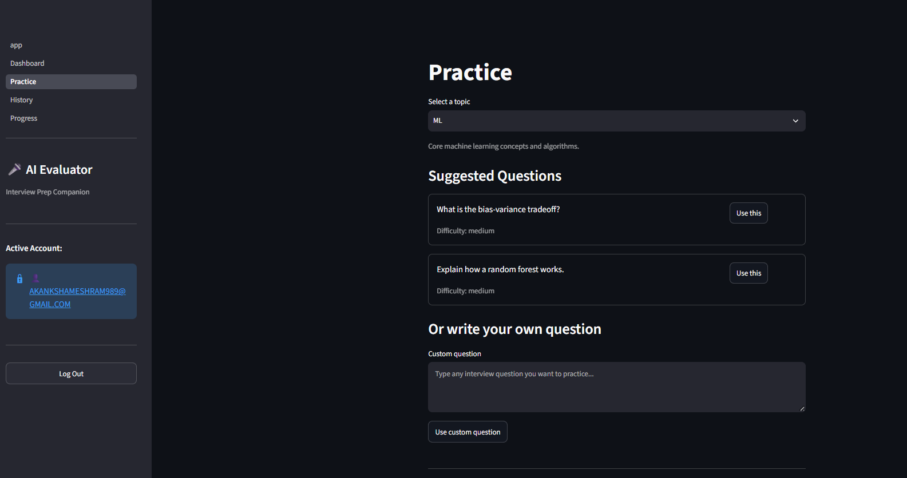
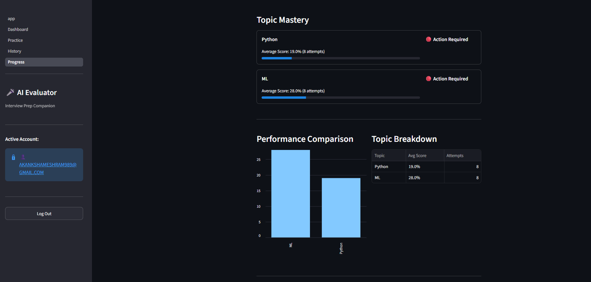

# AI Interview Answer Evaluator

An AI-powered web app where users practice technical interview questions — by topic or their own custom question, typed or spoken — and receive structured, explainable feedback: an overall score, dimension-level scores, concept-by-concept coverage, and concrete improvement suggestions.

Built as a 14-day solo project, from a blank repo to a deployed, tested, documented product.

---

## Live Demo

- **App (Streamlit frontend):** https://ai-interview-evaluator-4q9e.onrender.com/
- **API (FastAPI backend):** https://ai-interview-evaluator-hdxu.onrender.com/docs

> **Note:** Both services run on Render's free tier, which spins down after ~15 minutes of inactivity. The first request after idle time can take 30–90 seconds while the service wakes back up — this is expected behavior, not an error. If the app seems unresponsive on first load, wait a moment and refresh.

---

## Screenshots

**Login / Register**


**Dashboard** — recent attempts, quick metrics, start practice


**Practice** — topic selection, suggested questions, custom question entry


**Progress** — topic mastery bars and performance comparison


---

## Features (V1 Scope)

- Email/password authentication with JWT-based sessions
- Topic selection across ML, DL, NLP, Python, SQL, and GenAI
- Suggested questions per topic, or any custom question of the user's own
- Text answers or voice answers (recorded in-browser, transcribed automatically)
- Editable transcript review before submitting a voice answer
- Automatic, question-specific evaluation rubric generation
- Overall score plus dimension scores (correctness, completeness, clarity)
- Concept-level feedback: covered / partially covered / missing, with evidence
- Basic technical-misconception detection with corrective explanations
- Persistent history of every attempt, filterable by topic/mode/score/date
- Per-topic progress tracking (average score, attempt count, trend charts)

---

## Architecture

```
Streamlit (frontend)  →  FastAPI (backend)  →  PostgreSQL (Supabase)
                              ↓
                    ML evaluation pipeline
              (analyzer → rubric → coverage →
               technical checks → scoring → feedback)
                              ↓
                    Groq API (LLM + hosted Whisper STT)
```

**Why this split:** Streamlit handles all presentation and user interaction; it never touches the database or runs evaluation logic directly. FastAPI owns every piece of business logic — authentication, evaluation orchestration, transcription, and all database access. This keeps the core evaluation engine fully decoupled from the UI layer, so a different frontend (e.g. React) could replace Streamlit later without touching the database schema or the ML pipeline at all.

### Backend structure
```
backend/
├── main.py            # FastAPI entry point, CORS, router registration
├── routes/            # auth, topics, practice, attempts, progress
├── services/          # security (hashing, JWT, current-user dependency)
└── limiter.py          # shared rate limiter instance

ml/
├── question_analyzer.py     # expected concepts: DB lookup or LLM-derived
├── rubric_builder.py         # concepts -> weighted rubric
├── embedding_service.py       # TF-IDF vectorization + cosine similarity
├── coverage_engine.py          # per-concept covered/partial/missing + evidence
├── technical_checker.py         # known-misconception flagging
├── scoring_engine.py             # weighted dimension + overall scoring
├── feedback_generator.py          # strengths/gaps/improvements text
├── evaluation_service.py            # orchestrates the full pipeline
└── benchmark/                        # labeled Q&A set + calibration tooling

database/
├── models.py     # SQLAlchemy models
├── connection.py  # engine/session setup
└── seed.py         # topics + suggested questions seed data

tests/            # unit tests (scoring/rubric/coverage) + API tests (auth/isolation)
```

---

## Tech Stack

| Layer | Technology | Notes |
|---|---|---|
| Frontend | Streamlit | Multipage app, `st.session_state` for auth/practice state |
| Backend | FastAPI + Uvicorn | REST API, JWT auth, rate limiting via `slowapi` |
| Database | PostgreSQL (Supabase) | SQLAlchemy ORM |
| LLM (rubric generation) | Groq API — `openai/gpt-oss-20b` | Used only for questions without a pre-authored rubric |
| Speech-to-Text | Groq API — `whisper-large-v3-turbo` | Hosted, not run locally (see *Design Decisions* below) |
| Concept matching | scikit-learn — TF-IDF + cosine similarity | Used instead of neural embeddings (see below) |
| Testing | pytest + FastAPI `TestClient` | 25 automated tests: unit + API/integration |
| Deployment | Render (two separate web services) | Free tier |

### Design decisions worth explaining

**Why Groq's hosted Whisper API instead of running Whisper locally.** The original plan (per the technical spec) was a local open-source Whisper variant. In practice, both `openai-whisper` (PyTorch-based) and `faster-whisper` (CTranslate2-based) produced unrecoverable native-library crashes on the development machine — a PyTorch DLL load failure and a raw Windows access violation in CTranslate2, neither of which is fixable from Python code. Rather than continuing to fight OS/hardware-level binary compatibility, transcription was moved to Groq's hosted Whisper endpoint. This is explicitly one of the two supported options in the project's own technical requirements ("Whisper/open-source Whisper variant **or suitable cloud STT API**"), and it fully eliminated the crash risk since nothing STT-related runs locally anymore.

**Why TF-IDF instead of sentence-transformers for concept coverage.** `sentence-transformers` depends on PyTorch — the same library implicated in the STT crash above. To avoid reintroducing that risk, concept-to-answer similarity is computed with scikit-learn's TF-IDF vectorizer and cosine similarity instead of neural embeddings. This is a legitimate, if less semantically powerful, alternative — see *Known Limitations* for its measured accuracy tradeoffs.

---

## Setup / Local Development

### Prerequisites
- Python 3.12+
- A PostgreSQL database (Supabase recommended)
- A Groq API key (free tier available at [console.groq.com](https://console.groq.com))

### Clone and install
```bash
git clone https://github.com/Akankshameshram29/AI-Interview-Evaluator.git
cd AI-Interview-Evaluator

python -m venv venv
venv\Scripts\activate        # Windows
# source venv/bin/activate   # macOS/Linux

pip install -r requirements.txt
```

### Configure environment
Create a `.env` file in the project root:
```
DATABASE_URL=postgresql://postgres:<password>@<host>:5432/postgres
JWT_SECRET=<a long random string>
GROQ_API_KEY=<your Groq API key>
```

### Seed the database
```bash
python -m database.seed
```

### Run both services (two terminals)
```bash
# Terminal 1 — backend
uvicorn backend.main:app --reload --port 8000

# Terminal 2 — frontend
streamlit run app.py
```
Visit `http://localhost:8501`. The backend's interactive docs are available at `http://localhost:8000/docs`.

---

## Evaluation Methodology & Calibration

Every submitted answer goes through one pipeline (`ml/evaluation_service.py`):

1. **Question analysis** — for suggested questions, expected concepts come directly from the seeded database; for custom questions, a Groq LLM call derives 3–6 expected concepts on the fly, with a keyword-based fallback if the LLM call fails for any reason.
2. **Rubric building** — concepts are converted into a weighted rubric (equal weights by default, summing to 100).
3. **Coverage matching** — each rubric concept is compared against the answer's sentences via TF-IDF cosine similarity, and classified as **covered**, **partial**, or **missing**, with the best-matching sentence returned as evidence.
4. **Technical checks** — the answer is scanned against a small, curated list of known interview misconceptions per topic (exact-phrase matching, chosen deliberately over a general-purpose LLM fact-checker to avoid false positives).
5. **Scoring** — completeness (weighted concept coverage), correctness (coverage baseline, penalized by any technical flags, capped low if a misconception is detected), and clarity (a length-based heuristic) combine into a weighted overall score.
6. **Feedback generation** — structured strengths, gaps, and improvement suggestions are generated from the above, in the order: overall score → dimension breakdown → concept coverage → strengths/corrections → improvement plan → original Q&A.

### Calibration process and results

A benchmark of 15 hand-labeled Q&A pairs was built across all six topics (ML, DL, NLP, Python, SQL, GenAI), each labeled with a human-judged score and which concepts a human grader considers genuinely covered. An automated script (`ml/benchmark/run_benchmark.py`) runs every example through the real evaluation pipeline and reports:

- Precision / recall / F1 on concept coverage (comparing the model's covered/partial/missing calls against human judgment)
- Average absolute difference between the model's overall score and the human-assigned score
- A threshold sweep (0.05–0.43) to find the coverage threshold that maximizes F1

**Final calibrated result:** F1 = 0.514 (precision 0.409, recall 0.692) at a covered-threshold of 0.09; average absolute score deviation from human judgment = 24.1 points.

Threshold selection required several iterations, since the benchmark's small size (~83 concept-level data points from 15 examples) caused the "best" threshold to shift somewhat between runs as other scoring parameters (clarity bands, technical-flag score cap) were also being tuned. The final values were chosen as the threshold most consistently recommended across repeated sweeps, alongside the corresponding lowest observed score deviation — a defensible, evidence-based choice rather than a single-example guess.

---

## Known Limitations

- **TF-IDF favors recall over precision.** It reliably catches genuinely covered concepts but sometimes over-credits partial matches, and can miss concepts explained using very different vocabulary than the rubric's phrasing (e.g. a correct explanation of a concept that never uses the concept's own name). A neural embedding approach would likely improve precision but was avoided due to the native-library crashes described above.
- **The technical misconception checker is narrow by design.** It only catches a small, hand-curated list of common wrong statements per topic via exact-phrase matching — it is not a general-purpose fact-checker, and a wrong statement not on the list will not be flagged.
- **Clarity is a length-based heuristic**, not a true measure of structure or reasoning quality — a deliberate, transparent simplification rather than a deeper NLP pass.
- **Progress tracking is topic-level, not concept-level.** "Weak areas" are surfaced as topics with a low average score, not a fine-grained breakdown of which specific concepts a user struggles with across all their attempts.
- **Free-tier hosting cold starts**, as noted above.
- **The 15-example benchmark is small.** Calibration is evidence-based but not statistically robust at this scale; a larger, more diverse labeled set would allow more confident threshold tuning.

---

## Testing

25 automated tests (`pytest tests/ -v`):
- **Unit tests** — scoring engine (completeness/correctness/clarity edge cases, technical-flag score capping), rubric builder (weight distribution, empty input), coverage engine (empty rubric/answer handling, relative similarity ordering), and the audio file-size validation helper.
- **API/integration tests** — registration/login flow, duplicate email rejection, wrong-password rejection, protected-route rejection with no/invalid token, and — critically — **cross-user data isolation**: a user cannot view another user's attempt by id (404, not another user's data) and does not see another user's attempts in their own history list.

Manually verified in addition to the automated suite: session-expiry handling mid-practice, voice error states (no speech detected, STT service unavailable, mic permission denied), state transitions when switching topics/answer modes mid-flow, and rate limiting on the evaluation and transcription endpoints (10 requests/minute).

---

## Deferred to V2

Per the original project scope, the following were intentionally left out of V1:
- Speaking pace / filler-word / pronunciation / voice-emotion analysis
- Video interview analysis
- Adaptive difficulty
- AI-generated follow-up questions / full interview simulation
- Concept-level (rather than topic-level) weak-area tracking
- Optional React frontend, if a richer production UI is later required
